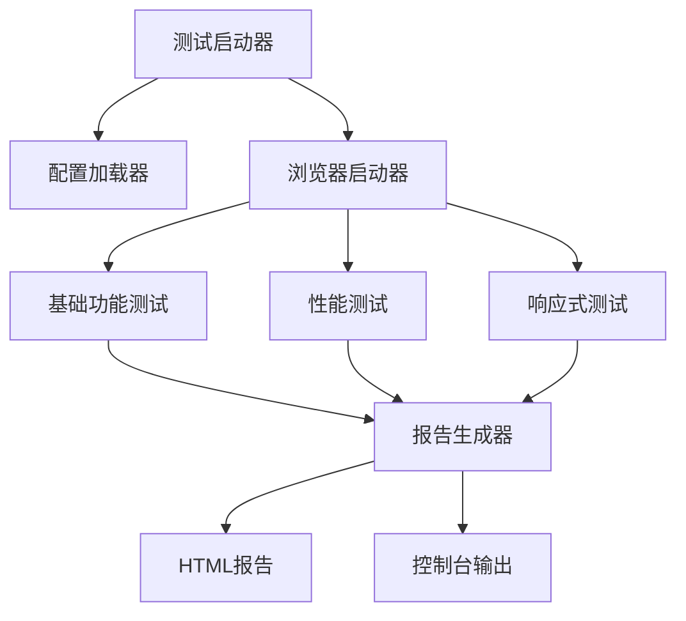

# 设计文档

## 概述

本地可用性测试工具是一个轻量级的测试解决方案，专为Chat4项目的本地开发环境设计。工具采用简单的脚本架构，使用Playwright进行基础的浏览器自动化，重点关注快速验证和简单报告生成。

## 架构

### 系统架构图



### 技术栈选择

- **浏览器自动化**: Playwright (仅Chrome，简化配置)
- **配置管理**: JSON配置文件
- **报告生成**: 简单的HTML模板
- **性能监控**: 基础的页面性能API

## 组件和接口

### 核心组件

#### 1. 测试运行器 (TestRunner)

```typescript
interface TestRunner {
  runAllTests(): Promise<TestResult>
  runBasicTests(): Promise<TestResult>
  runPerformanceTests(): Promise<TestResult>
  runResponsiveTests(): Promise<TestResult>
}

interface TestConfig {
  baseUrl: string
  timeout: number
  viewports: ViewportSize[]
  performanceThresholds: {
    loadTime: number
    firstContentfulPaint: number
  }
}
```

#### 2. 浏览器助手 (BrowserHelper)

```typescript
interface BrowserHelper {
  launch(): Promise<Browser>
  close(): Promise<void>
  takeScreenshot(name: string): Promise<string>
  setViewport(width: number, height: number): Promise<void>
}
```

#### 3. 报告生成器 (ReportGenerator)

```typescript
interface ReportGenerator {
  generateReport(results: TestResult[]): Promise<string>
  openReport(filePath: string): Promise<void>
}
```

### API接口设计

#### REST API端点

```typescript
// 测试管理
POST /api/tests/start - 启动测试
GET /api/tests/:id/status - 获取测试状态
DELETE /api/tests/:id - 取消测试
GET /api/tests/history - 获取测试历史

// 配置管理
GET /api/config - 获取当前配置
PUT /api/config - 更新配置
POST /api/config/validate - 验证配置

// 报告管理
GET /api/reports/:id - 获取报告
GET /api/reports/:id/download - 下载报告
POST /api/reports/:id/email - 发送邮件报告
```

#### WebSocket接口

```typescript
// 实时测试状态更新
interface TestStatusUpdate {
  executionId: string
  status: 'running' | 'completed' | 'failed' | 'cancelled'
  progress: number
  currentTest: string
  results?: Partial<TestResult>
}
```

## 数据模型

### 配置数据结构

```typescript
interface TestConfig {
  baseUrl: string
  timeout: number
  viewports: Array<{
    name: string
    width: number
    height: number
  }>
  performanceThresholds: {
    loadTime: number
    firstContentfulPaint: number
  }
  outputDir: string
}
```

### 测试结果结构

```typescript
interface TestResult {
  timestamp: string
  passed: boolean
  tests: {
    basic: BasicTestResult
    performance: PerformanceTestResult
    responsive: ResponsiveTestResult
  }
  screenshots: string[]
  errors: string[]
}

interface BasicTestResult {
  passed: boolean
  checks: {
    pageLoads: boolean
    chatInputExists: boolean
    basicUIElements: boolean
  }
}

interface PerformanceTestResult {
  passed: boolean
  metrics: {
    loadTime: number
    firstContentfulPaint: number
    memoryUsage: number
  }
}

interface ResponsiveTestResult {
  passed: boolean
  viewports: Array<{
    name: string
    passed: boolean
    issues: string[]
  }>
}
```

## 错误处理

### 错误分类和处理策略

#### 1. 系统级错误
- **浏览器启动失败**: 重试机制，降级到其他浏览器
- **网络连接问题**: 指数退避重试，超时处理
- **资源不足**: 队列管理，优雅降级

#### 2. 测试级错误
- **页面加载超时**: 记录错误，继续其他测试
- **元素定位失败**: 多种定位策略，截图记录
- **断言失败**: 详细错误信息，上下文保存

#### 3. 配置错误
- **无效配置**: 配置验证，默认值回退
- **权限问题**: 清晰的错误提示，解决建议

### 错误恢复机制

```typescript
interface ErrorRecoveryStrategy {
  retryCount: number
  retryDelay: number
  fallbackAction?: () => Promise<void>
  skipOnFailure: boolean
  notifyOnError: boolean
}

class TestErrorHandler {
  async handleError(error: TestError, strategy: ErrorRecoveryStrategy): Promise<void> {
    // 记录错误详情
    await this.logError(error)
    
    // 尝试恢复
    if (strategy.retryCount > 0) {
      await this.retry(error, strategy)
    }
    
    // 执行回退策略
    if (strategy.fallbackAction) {
      await strategy.fallbackAction()
    }
    
    // 发送通知
    if (strategy.notifyOnError) {
      await this.notifyError(error)
    }
  }
}
```

## 测试策略

### UI测试策略

#### 页面对象模型 (POM)
```typescript
class ChatPage {
  constructor(private page: Page) {}
  
  async sendMessage(message: string): Promise<void> {
    await this.page.fill('[data-testid="message-input"]', message)
    await this.page.click('[data-testid="send-button"]')
  }
  
  async waitForResponse(): Promise<string> {
    await this.page.waitForSelector('[data-testid="ai-response"]')
    return await this.page.textContent('[data-testid="ai-response"]')
  }
  
  async takeScreenshot(): Promise<Buffer> {
    return await this.page.screenshot()
  }
}
```

#### 测试用例组织
- **冒烟测试**: 核心功能快速验证
- **回归测试**: 完整功能覆盖
- **边界测试**: 异常情况处理
- **用户流程测试**: 端到端场景

### 性能测试策略

#### 关键指标监控
- **First Contentful Paint (FCP)**: < 1.5s
- **Largest Contentful Paint (LCP)**: < 2.5s
- **Cumulative Layout Shift (CLS)**: < 0.1
- **First Input Delay (FID)**: < 100ms

#### 性能测试实现
```typescript
class PerformanceTester {
  async measurePagePerformance(url: string): Promise<PerformanceMetrics> {
    const page = await this.browser.newPage()
    
    // 启用性能监控
    await page.coverage.startJSCoverage()
    await page.coverage.startCSSCoverage()
    
    const startTime = Date.now()
    await page.goto(url)
    
    // 等待页面完全加载
    await page.waitForLoadState('networkidle')
    
    const metrics = await page.evaluate(() => {
      const navigation = performance.getEntriesByType('navigation')[0]
      return {
        loadTime: navigation.loadEventEnd - navigation.loadEventStart,
        domContentLoaded: navigation.domContentLoadedEventEnd - navigation.domContentLoadedEventStart,
        firstPaint: performance.getEntriesByName('first-paint')[0]?.startTime,
        firstContentfulPaint: performance.getEntriesByName('first-contentful-paint')[0]?.startTime
      }
    })
    
    return metrics
  }
}
```

### 可访问性测试策略

#### WCAG 2.1 AA级别合规性检查
- **颜色对比度**: 4.5:1 (普通文本), 3:1 (大文本)
- **键盘导航**: 所有交互元素可通过键盘访问
- **屏幕阅读器**: ARIA标签和语义化HTML
- **焦点管理**: 清晰的焦点指示器

#### 自动化可访问性测试
```typescript
class AccessibilityTester {
  async runAccessibilityAudit(page: Page): Promise<AccessibilityResult> {
    // 注入axe-core库
    await page.addScriptTag({ path: require.resolve('axe-core') })
    
    // 运行可访问性检查
    const results = await page.evaluate(() => {
      return new Promise((resolve) => {
        axe.run((err, results) => {
          if (err) throw err
          resolve(results)
        })
      })
    })
    
    return this.processAxeResults(results)
  }
}
```

## CI/CD集成设计

### GitHub Actions集成

```yaml
name: Automated Usability Testing
on:
  push:
    branches: [main, develop]
  pull_request:
    branches: [main]

jobs:
  usability-tests:
    runs-on: ubuntu-latest
    steps:
      - uses: actions/checkout@v3
      - uses: actions/setup-node@v3
        with:
          node-version: '18'
      
      - name: Install dependencies
        run: npm ci
      
      - name: Install Playwright
        run: npx playwright install
      
      - name: Run usability tests
        run: npm run test:usability
        env:
          TEST_ENV: ci
          HEADLESS: true
      
      - name: Upload test reports
        uses: actions/upload-artifact@v3
        if: always()
        with:
          name: test-reports
          path: reports/
```

### 测试结果集成

```typescript
class CIIntegration {
  async reportToCI(results: TestResult[]): Promise<void> {
    const summary = this.generateSummary(results)
    
    // GitHub Actions注释
    if (process.env.GITHUB_ACTIONS) {
      await this.createGitHubComment(summary)
    }
    
    // 设置退出码
    const hasFailures = results.some(r => r.status === 'failed')
    if (hasFailures) {
      process.exit(1)
    }
  }
}
```